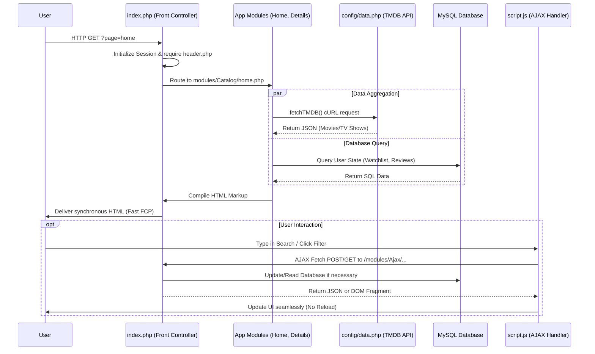

# CelesView 🎬
<div align="center">
  <h3>Interactive Movie & TV Show Catalog</h3>
  <p>A premium, cinematic web platform that delivers rich media content using real-time data from TMDB.</p>

  <!-- Badges -->
  
  
  
  
  
</div>

---

## 🌟 Key Features

| Feature | Description |
|---|---|
| **Cinematic Hero Slider** | Immersive front-page hero banners with dynamic backdrop fetching, custom Ken Burns animation, and crossfade transitions. |
| **Live Search AJAX** | Real-time search functionality integrated seamlessly into the navigation bar, offering instant results without page reloads. |
| **User Rating & Review System** | A comprehensive rating system ala Metacritic, where users can leave scored reviews. A color-coded semantic system indicates critical reception. |
| **Advanced Filtering & Sort** | Intuitive modal and pill-based filters allowing users to filter content by genres, release date, popularity, and specific ratings asynchronously. |
| **Split-Card Authentication** | Modern, layout-driven authentication screens (Login & Register) implementing a beautiful split-screen design. |
| **Personalized Watchlist** | Logged-in users can curate their own watchlist that persists securely in the database. |
| **Bilingual Support** | Seamless dynamic language toggle (ID/EN) that updates API payloads and frontend interfaces via cookie states. |
| **Smart Notification System** | Custom polling and rendering for user-centric alerts (likes, recommendations) tied to the platform's social features. |

---

## 🎨 UI/UX Design Philosophy

CelesView was engineered from the ground up to mimic the premium aesthetics of major streaming platforms (like Netflix and HBO Max). The design ethos prioritizes immersion, visual feedback, and frictionless navigation.

### 🌌 Theme "Modern Sci-Fi Dark"
The interface is intentionally kept dark and restrained. By utilizing a deep, dark slate canvas, we allow the vibrant movie posters, cinematic backdrops, and video trailers to naturally command the user's attention. The UI completely steps back, ensuring that the media artwork remains the undisputed centerpiece. Extensive use of gradient overlays and vignettes ensures text remains highly legible against complex background images.

### 💫 Micro-interactions & Fluidity
Every interaction on the platform feels tactile and responsive. 
- **Hover States & Glow:** Elements like the navigation icons and movie posters feature subtle scaling (`transform: scale()`) and dynamic box-shadows (`#00D2FF`) that provide immediate visual feedback. 
- **Skeleton Loaders:** To prevent layout shifts and jarring transitions, we implement sleek skeleton loading screens while AJAX requests are resolving.
- **Typing Animations:** A custom JavaScript typing effect within the main search bar serves as a passive micro-interaction, keeping the interface feeling alive even when idle.

### ⚡ Asynchronous UX
Page reloads are the enemy of immersion. CelesView heavily relies on asynchronous JavaScript (`fetch` / AJAX) to load content dynamically:
- **Filtering:** Clicking genre pills or dragging the rating slider instantly updates the media grid.
- **Search:** The predictive dropdown renders real-time TMDB data seamlessly.
- **Watchlist & Ratings:** Submitting reviews and toggling watchlist states occur in the background, updating the UI instantaneously to maintain a frictionless user flow.

---

## 🖌️ Color Palette & Typography

CelesView employs a carefully curated, highly specific color system to ensure maximum contrast and visual hierarchy.

| Concept | HEX Code | Description |
|---|---|---|
| **Main Background** | `#0F0F0F` | Pitch black canvas designed to completely minimize eye strain and simulate a darkened theater environment. |
| **Surface / Cards** | `#1E293B` | A dark slate blue utilized for modals, dropdowns, and input fields. It creates necessary depth and elevation against the true black background. |
| **Primary Accent** | `#00D2FF` & `#0EA5E9` | Electric cyan and vivid blue. Used specifically for primary Call-to-Action buttons, active state indicators, hover glowing effects, and essential links. |
| **Text Primary** | `#F8FAFC` | Off-white text that ensures high readability without the harshness of pure `#FFFFFF`. |
| **Text Muted** | `#94A3B8` | A cool, bluish-gray utilized for metadata (release year, runtime) and secondary information to establish typographic hierarchy. |

### Semantic Colors (User Rating System)
We mapped our rating colors explicitly to mirror Metacritic’s universal standards:
- 🟢 **Universal Acclaim:** `#22c55e` (Score >= 80)
- 🟡 **Mixed or Average:** `#eab308` (Score 50 - 79)
- 🔴 **Generally Unfavorable:** `#ef4444` (Score < 50)

---

## 🏗️ Technical Architecture & Database

CelesView is built upon a **Custom MVC-like PHP Architecture**, maximizing raw performance and avoiding unnecessary framework bloat.

### Architecture Highlights
- **Front Controller Pattern:** All traffic routes exclusively through `index.php?page=...`, enforcing a single point of entry and simplified routing logic.
- **TMDB API Integration:** Centralized in `config/data.php`, utilizing custom `fetchTMDB()` cURL wrappers.
- **TTL Caching:** API responses are cached via a bespoke Time-to-Live (TTL) system to strictly minimize external rate-limit hits and drastically improve load times.

### 🗄️ Database Schema (MySQL)
The relational database is normalized to handle user states, social features, and generated content effectively. Below is the simplified schema structure:

#### `users` (Authentication & Profiles)
| Column | Type | Attributes | Description |
|---|---|---|---|
| `id` | INT | PRIMARY KEY, AUTO_INCREMENT | Unique user identifier |
| `name` | VARCHAR(255) | NOT NULL | Display name |
| `email` | VARCHAR(255) | UNIQUE, NOT NULL | Login credential |
| `password` | VARCHAR(255) | NOT NULL | Hashed password |
| `avatar` | VARCHAR(255) | DEFAULT NULL | Profile image path |
| `role` | ENUM | 'user', 'admin' | Access level |

#### `user_follows` (Social Follow System)
| Column | Type | Attributes | Description |
|---|---|---|---|
| `follower_id` | INT | PRIMARY KEY (Composite) | ID of the user following |
| `following_id` | INT | PRIMARY KEY (Composite) | ID of the user being followed |

#### `watchlist` (Personalized Watchlists)
| Column | Type | Attributes | Description |
|---|---|---|---|
| `id` | INT | PRIMARY KEY, AUTO_INCREMENT | Unique record ID |
| `user_id` | INT | NOT NULL | Reference to `users.id` |
| `media_id` | INT | NOT NULL | TMDB Media ID |
| `media_type` | ENUM | 'movie', 'tv' | Type of media |

#### `reviews` (User Reviews & Ratings)
| Column | Type | Attributes | Description |
|---|---|---|---|
| `id` | INT | PRIMARY KEY, AUTO_INCREMENT | Unique review ID |
| `user_id` | INT | NOT NULL | Reference to `users.id` |
| `media_id` | INT | NOT NULL | TMDB Media ID |
| `media_type` | ENUM | 'movie', 'tv' | Type of media |
| `rating` | INT | CHECK (1-5) | Metric score |
| `review_text` | TEXT | NULLABLE | User's written review |

#### `notifications` (Dynamic Alerts)
| Column | Type | Attributes | Description |
|---|---|---|---|
| `id` | INT | PRIMARY KEY, AUTO_INCREMENT | Unique notification ID |
| `user_id` | INT | NOT NULL | Reference to `users.id` |
| `type` | ENUM | 'like', 'follow', ... | Notification category |
| `title` | VARCHAR(255) | NOT NULL | Short alert title |
| `message` | TEXT | NULLABLE | Detailed alert body |
| `is_read` | BOOLEAN | DEFAULT FALSE | Read state toggle |

*(Note: All tables implicitly include a `created_at` TIMESTAMP column).*

### 📁 Directory Structure
To maintain scalability, the project follows a flat, modular directory structure separated by domains:

```text
/Web-Katalog-Film
│
├── index.php                 # Front Controller & Main Router
├── README.md                 # Project Documentation
│
├── config/
│   ├── db.php                # MySQL Database Connection Logic
│   └── data.php              # TMDB API Wrappers, cURL fetch logic, Configs
│
├── includes/
│   ├── header.php            # Global Header, CSS links, Navbar, Search Bar
│   └── footer.php            # Global Footer, JS scripts execution
│
├── assets/
│   ├── css/                  # Styling system (Modular CSS architecture)
│   │   ├── style.css         # Main stylesheet & global variables
│   │   └── components/       # Component-specific styles (navbar, forms, cards)
│   ├── js/                   # Vanilla JavaScript files (AJAX, Interactions)
│   └── images/               # Local image assets
│
└── modules/                  # Application Modules (Pages & Endpoints)
    ├── Auth/                 # Authentication (Login, Register)
    ├── Catalog/              # Content Browsing (Home, Movies, Details, Search)
    ├── User/                 # Profiles, Reviews, Watchlists, Social Features
    ├── playlists/            # Custom user playlist generation
    └── Ajax/                 # Backend endpoint handlers for async JSON/HTML responses
```

### 🔄 System Flow (How it works)
The platform is designed around a synchronous rendering base augmented by asynchronous user interactions:



---

## 🚀 Installation & Local Configuration

Follow these steps to deploy CelesView locally via XAMPP or any equivalent AMP stack:

### 1. Requirements
- PHP >= 8.1
- MySQL / MariaDB
- cURL enabled in `php.ini`

### 2. Environment Setup
1. Clone the repository into your web root directory (e.g., `C:\xampp\htdocs\celesview`).
2. Start **Apache** and **MySQL** via the XAMPP Control Panel.
3. Access phpMyAdmin (`http://localhost/phpmyadmin`) and create a new database named `celesview_db` (or as preferred).
4. Import the provided `.sql` dump file (if available) into the database, or let the backend's auto-migration queries build the required tables.

### 3. Application Configuration
Open the `config/db.php` file and update your MySQL credentials:
```php
<?php
$host = "localhost";
$user = "root";
$pass = "";
$dbname = "celesview_db"; // Ensure this matches step 2

$conn = new mysqli($host, $user, $pass, $dbname);
if ($conn->connect_error) {
    die("Database Connection Failed: " . $conn->connect_error);
}
?>
```

### 4. TMDB API Key (Critical)
To fetch movies and TV shows, you must supply your own TMDB API key.
Open `config/data.php` and locate line 2:
```php
$tmdbApiKey = "YOUR_TMDB_API_KEY_HERE";
```
*Note: You can acquire a free API key by registering at [The Movie Database (TMDB)](https://www.themoviedb.org/).*

### 5. Launch
Open your web browser and navigate to:
```
http://localhost/celesview/Web-Katalog-Film/
```
You are now ready to explore CelesView! 🍿
